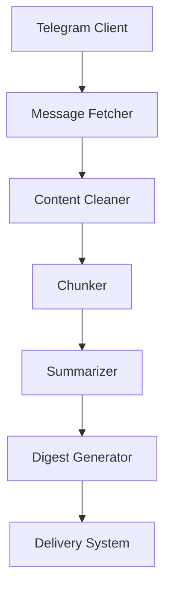

# Telegram Summarizer System Patterns

## Architecture Overview

## Key Components
1. **Telegram Fetcher** (telegram_fetcher.py)
   - Handles API connections
   - Manages message retrieval
   - Implements rate limiting

2. **Processing Pipeline** (tasks.py)
   - Cleaning: Removes noise from messages
   - Chunking: Groups related messages
   - Summarization: AI-powered condensation

3. **Delivery System** (main.py)
   - Scheduled execution
   - Output formatting
   - Notification delivery

## Data Flow
1. Raw messages → Cleaned text
2. Cleaned text → Logical chunks
3. Chunks → Summarized insights
4. Insights → Formatted digest
