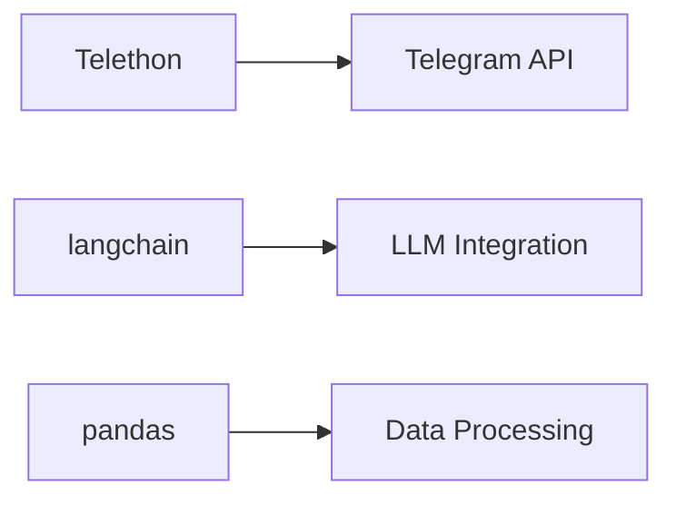

# Telegram Summarizer Tech Context

## Core Technologies
- **Python 3.10+**
  - AsyncIO for concurrent operations
  - Telethon for Telegram API
  - LangChain for summarization

## Key Dependencies

## Development Setup
1. **Environment**:
   - Virtualenv with Python 3.10
   - .env for credentials
   - requirements.txt for dependencies

2. **Configuration**:
   - API keys in config.py
   - Session management in telegram_digest_session.session
   - Runtime parameters in tasks.py

## Architectural Constraints
- Rate limits from Telegram API
- Token limits for LLM summarization
- Local storage for session persistence
